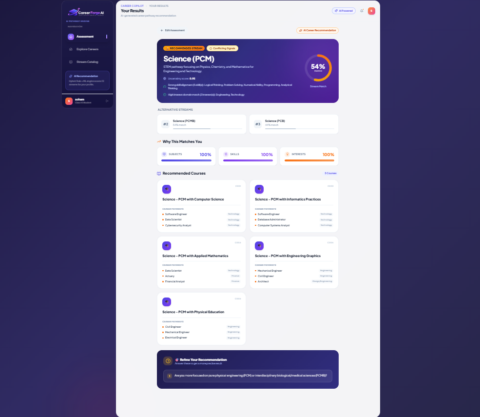

# Career Forge AI 🎓

> AI-powered academic stream & career recommendation system for Class 10 students.

## Preview



---

## Live Deployment

| Service | URL | Status |
|---|---|---|
| **Frontend** (Netlify) | https://dhruvsisodiya.netlify.app | React SPA |
| **Backend API** (Render) | https://career-copilot-api-9591.onrender.com | ✅ Live |
| **API Health Check** | https://career-copilot-api-9591.onrender.com/api/v1/health | `{"status":"ok"}` |
| **API Docs (Swagger)** | https://career-copilot-api-9591.onrender.com/docs | Interactive |

> The backend is deployed on Render's free tier. First request after inactivity may take 30–60 seconds to wake up — this is expected.

---

## Overview

Career Copilot helps students navigate the critical Class 10 → Class 11 transition. A student enters their favourite subjects, key skills, and areas of interest. The hybrid AI engine scores all 12 academic streams and returns a ranked recommendation with match scores, mapped courses, career pathways, and targeted follow-up questions when the result is ambiguous.

---

## Features

- **Hybrid AI Recommendation** — Combines a domain rule engine with a calibrated Logistic Regression ML model to score all 12 streams and return a ranked top-3 list
- **Animated Results UI** — SVG score ring, match breakdown bars (subject/skill/interest), and confidence status badge
- **Uncertainty Awareness** — Every result carries a status: `high_confidence`, `moderate_confidence`, `conflicting_evidence`, or `needs_more_information`
- **Adaptive Follow-up Questions** — Generated when streams are closely scored or when inputs are sparse
- **Course & Career Mapping** — Top recommended stream links to relevant courses and career options
- **12 Stream Catalog** — Browse all Class 11–12 academic pathways with domain tags
- **Career Explorer** — Search and filter 200+ careers across Technology, Engineering, Healthcare, Finance, Law, and Creative domains
- **Form Validation** — Assessment enforces selection across all 3 categories (subjects + skills + interests) before submission
- **Modern UI** — Dark glassmorphism landing screen, step-based tabbed assessment, fully responsive sidebar layout

---

## Tech Stack

| Layer | Technology | Version |
|---|---|---|
| Frontend | React | 18.3.1 |
| Build Tool | Vite | 6.0.7 |
| Styling | Tailwind CSS | 3.4.17 |
| HTTP Client | Axios | 1.7.9 |
| Icons | Lucide React | 0.469.0 |
| Backend | FastAPI | 0.115.0 |
| Server | Uvicorn | 0.30.6 |
| Validation | Pydantic | 2.9.2 |
| ML | scikit-learn | 1.5.2 |
| Data | pandas | 2.2.3 |
| Numerics | NumPy | 1.26.4 |
| Frontend Deploy | Netlify | — |
| Backend Deploy | Render | — |

---

## Project Structure

```
AI-career-copilot-major-/
├── backend/
│   ├── app/
│   │   ├── main.py                         # FastAPI app, CORS config
│   │   ├── routes/
│   │   │   └── recommendation.py           # POST /api/v1/recommend
│   │   ├── models/
│   │   │   └── schemas.py                  # Pydantic request/response schemas
│   │   └── services/
│   │       ├── data_service.py             # CSV loader (8 dataset files)
│   │       └── recommendation_service.py  # Hybrid rule + ML engine
│   ├── data/
│   │   └── raw/career_copilot_expanded_dataset/
│   │       ├── streams.csv                 # 12 streams
│   │       ├── subjects.csv                # 105 subjects
│   │       ├── skills.csv                  # 76 skills
│   │       ├── interests.csv               # 59 interests
│   │       ├── courses.csv                 # 104 courses
│   │       ├── careers.csv                 # 200 careers
│   │       ├── course_career_mapping.csv
│   │       └── stream_recommendation_rules.csv  # 1,250 rule pairs
│   ├── ml/
│   │   ├── models/
│   │   │   ├── logistic_regression_model.pkl   # Trained & serialized
│   │   │   └── random_forest_model.pkl
│   │   ├── data/
│   │   │   ├── generate_synthetic_dataset.py
│   │   │   ├── synthetic_student_dataset.csv   # 600 profiles
│   │   │   └── held_out_test_set.csv           # 120 profiles
│   │   ├── train.py
│   │   ├── evaluate.py
│   │   └── robustness/                         # Noise experiment reports
│   ├── tests/
│   └── requirements.txt
├── frontend/
│   ├── src/
│   │   ├── App.jsx                         # Root app, routing, landing screen
│   │   ├── assets/logo.png                 # Official logo
│   │   ├── components/
│   │   │   ├── Header.jsx                  # Top bar with breadcrumb
│   │   │   └── Sidebar.jsx                 # Navigation sidebar
│   │   ├── views/
│   │   │   ├── AssessmentView.jsx          # Step-tabbed assessment form
│   │   │   ├── ResultsView.jsx             # Animated recommendation results
│   │   │   ├── StreamsView.jsx             # 12-stream catalog
│   │   │   └── CareersView.jsx             # Career explorer with search
│   │   ├── data/
│   │   │   ├── optionsData.js              # Subject/skill/interest chip lists
│   │   │   └── presetProfiles.js           # Sample student profiles
│   │   └── services/
│   │       └── api.js                      # Axios client → Render backend
│   ├── .env.production                     # VITE_API_BASE_URL for Netlify
│   ├── vite.config.js
│   └── package.json
├── docs/
│   ├── PROJECT_INFO.md
│   ├── ARCHITECTURE.md
│   └── screenshots/
│       └── dashboard.png
├── netlify.toml                            # Netlify build config
└── README.md
```

---

## Dataset Catalog

All reference data lives in `backend/data/raw/career_copilot_expanded_dataset/`.

| File | Records | Description |
|---|---|---|
| `streams.csv` | 12 | Academic stream definitions (S01–S12) |
| `subjects.csv` | 105 | Canonical subject names |
| `skills.csv` | 76 | Skills with category tags |
| `interests.csv` | 59 | Interest areas with category tags |
| `courses.csv` | 104 | Courses mapped to streams |
| `careers.csv` | 200 | Career names with domain tags |
| `course_career_mapping.csv` | — | Course → Career relationships |
| `stream_recommendation_rules.csv` | 1,250 | Domain rule pairs |

---

## Recommendation Engine

### System A — Rule Engine
Scores each stream against the student's matched subjects, skills (by category weight), and interests (by category weight).

```
Rule Score = 0.40 × skill_match + 0.40 × interest_match + 0.20 × subject_match
```

### System B — ML Classifier
Calibrated Logistic Regression trained on 600 synthetic profiles. Input: 240-dimensional multi-hot binary feature vector (105 subjects + 76 skills + 59 interests). Output: class probabilities for all 12 streams.

### System C — Adaptive Hybrid (production)

```
S_hybrid = w_rule × S_rule + w_ml × (P_ml × 100)
```

| Input Condition | w_rule | w_ml |
|---|---|---|
| Sparse / missing categories | 0.85 | 0.15 |
| Complete profile | 0.50 | 0.50 |

### Confidence Status

| Status | Trigger |
|---|---|
| `high_confidence` | ML margin ≥ 0.30 and rule margin ≥ 25 |
| `moderate_confidence` | ML margin 0.12–0.30 or rule margin < 20 |
| `conflicting_evidence` | ML margin < 0.12 and rule margin < 10 |
| `needs_more_information` | Total valid inputs ≤ 2 or missing categories |

---

## API Reference

**Base URL:** `https://career-copilot-api-9591.onrender.com`

### `GET /api/v1/health`

```json
{ "status": "ok" }
```

### `POST /api/v1/recommend`

**Request:**
```json
{
  "name": "Aarav Patel",
  "subjects": ["Mathematics", "Physics", "Computer Science"],
  "skills": ["Logical Thinking", "Problem Solving", "Programming"],
  "interests": ["Technology", "Engineering"]
}
```

**Response:**
```json
{
  "student_profile": { ... },
  "recommendation_metadata": {
    "recommendation_status": "high_confidence",
    "uncertainty_score": 0.12,
    "uncertainty_reason": "Strong clear alignment with target stream requirements.",
    "missing_information": [],
    "follow_up_questions": []
  },
  "recommendations": [
    {
      "rank": 1,
      "stream_id": "S01",
      "stream_name": "Science (PCM)",
      "score": 94.5,
      "skill_match_score": 97.0,
      "interest_match_score": 96.0,
      "subject_match_score": 100.0,
      "ml_probability": 0.9312,
      "recommended_courses": [ ... ]
    }
  ]
}
```

---

## Running Locally

### Prerequisites
- Python 3.10+
- Node.js 20+

### Frontend only (recommended — uses live Render backend)

```bash
cd frontend
npm install
npm run dev
```

Open `http://localhost:5173` — the frontend automatically connects to the live Render backend. No local Python server needed.

### Full local stack (optional — run backend locally too)

**Terminal 1 — Backend:**
```bash
python -m pip install -r backend/requirements.txt
python -m uvicorn backend.app.main:app --reload --host 127.0.0.1 --port 8000
```

**Terminal 2 — Frontend with local backend:**

Create `frontend/.env.local`:
```env
VITE_API_BASE_URL=http://127.0.0.1:8000
```

Then:
```bash
cd frontend
npm run dev
```

---

## Environment Variables

### Frontend

| Variable | Default | Description |
|---|---|---|
| `VITE_API_BASE_URL` | `https://career-copilot-api-9591.onrender.com` | Backend API base URL |

- **Local dev:** set in `frontend/.env.local`
- **Production:** set in `frontend/.env.production` or Netlify dashboard

---

## Deployment

### Frontend — Netlify

`netlify.toml` is pre-configured:
```toml
[build]
  base    = "frontend"
  command = "npm run build"
  publish = "dist"
```

Set `VITE_API_BASE_URL` in Netlify environment variables if needed. All SPA routes redirect to `index.html` automatically.

### Backend — Render

Deployed at `https://career-copilot-api-9591.onrender.com`.

To redeploy or self-host:
```bash
python -m uvicorn backend.app.main:app --host 0.0.0.0 --port 8000
```

> Free tier on Render spins down after inactivity. First cold-start request may take up to 60 seconds. The API timeout on the frontend is set to 60s to handle this.

---

## ML Pipeline

```bash
# Generate 600-profile synthetic dataset
python backend/ml/data/generate_synthetic_dataset.py

# Train and save models
python backend/ml/train.py

# Evaluate all systems on held-out test set (N=120)
python backend/ml/evaluate.py
```

### Benchmark Results (clean synthetic data, N=120)

| System | Top-1 Accuracy | Top-3 Accuracy | Macro F1 |
|---|---|---|---|
| Rule Engine Baseline | 91.67% | 100.00% | 91.68% |
| Pure ML (Logistic Regression) | 100.00% | 100.00% | 100.00% |
| Hybrid Ensemble | 100.00% | 100.00% | 100.00% |

> ⚠️ The 100% clean accuracy reflects deterministic synthetic data generation. See `backend/ml/robustness/ROBUSTNESS_REPORT.md` for full noise sensitivity analysis (accuracy drops to ~80% at 30% input noise).

---

## Robustness Summary

| Noise Level | Rule Top-1 | ML Top-1 | Hybrid Top-1 |
|---|---|---|---|
| 0% | 100.0% | 100.0% | 100.0% |
| 10% | 96.67% | 96.67% | 96.67% |
| 20% | 93.33% | 92.5% | 92.5% |
| 30% | 81.67% | 79.17% | 80.83% |

Rule engine consistently outperforms pure ML on sparse and missing-input profiles. The hybrid weight shift (0.85 rule / 0.15 ML for sparse inputs) compensates for this.

---

## Known Limitations

- **Synthetic training data** — ML model trained on synthetically generated profiles. Real-world accuracy will vary. Collecting real student feedback data is required for future model retraining.
- **Fixed vocabulary** — Unrecognized subject/skill/interest names are silently dropped and listed in `unrecognized_inputs` in the response.
- **No authentication** — No user accounts or result persistence in Phase 1.
- **Render cold starts** — Free tier backend takes up to 60s on first request after inactivity.
- **English only** — Dataset and UI are in English.
